# Tableau Assignment - Citi Bike Analytics

## Background

Congratulations on your new job! As the new lead analyst for the [New York Citi Bike](https://en.wikipedia.org/wiki/Citi_Bike) Program, you are now responsible for overseeing the largest bike sharing program in the United States. In your new role, you will be expected to generate regular reports for city officials looking to publicize and improve the city program.

Since 2013, the Citi Bike Program has implemented a robust infrastructure for collecting data on the program's utilization. Through the team's efforts, each month bike data is collected, organized, and made public on the [Citi Bike Data](https://www.citibikenyc.com/system-data) webpage.

However, while the data has been regularly updated, the team has yet to implement a dashboard or sophisticated reporting process. City officials have a number of questions on the program, so your first task on the job is to build a set of data reports to provide the answers. 

## Task

**Your task in this assignment is to aggregate the data found in the Citi Bike Trip History Logs to build a data dashboard, story, or report.  You may work with a timespan of your choosing.**

* The total trips have been 247,584 in 2016 and 273,742 in 2017, for a total of 521,326.

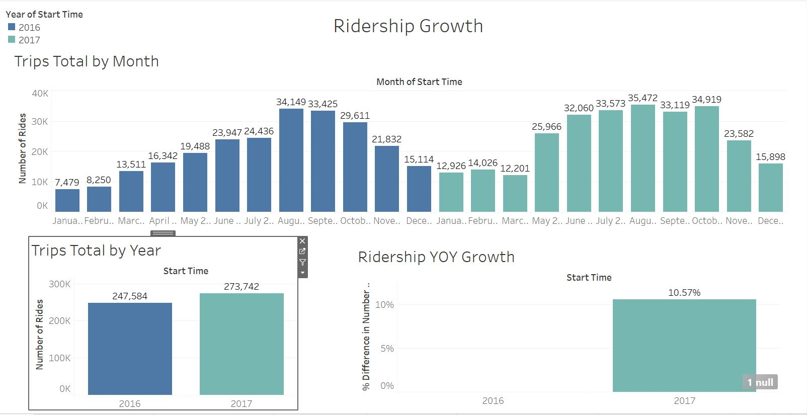

* Between 2016 and 2017, total ridership grew by 10.57%

* Subscribers have grown by almost 12% YoY, while the number of customers decreased by 8.5%, leading to speculation that more users are now becoming long-term rather than short-term.

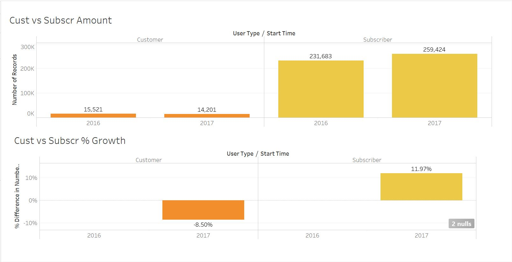

* The peak hours of usage during summer (June, July, and August) are 4 pm, 5 pm, and 7 am. Coincidentally, the peak hours in the winter (December, January, February) are also 4 pm, 5 pm, and 7 am.

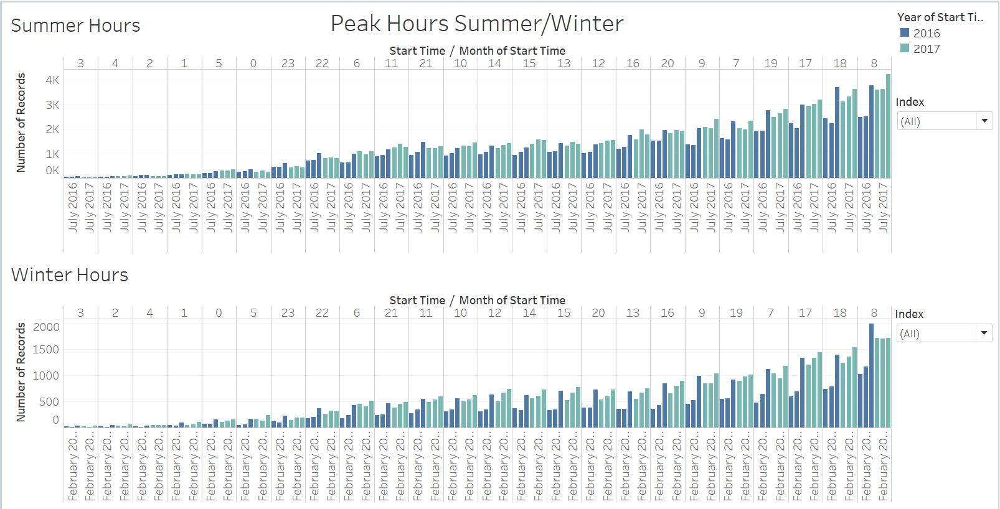

* The top 10 stations for starting a journey are all in Manhattan. This makes sense since most workers in Manhattan live elsewhere, and biking is another means of public transportation to get from Manhattan to the surrounding boroughs where most people live.

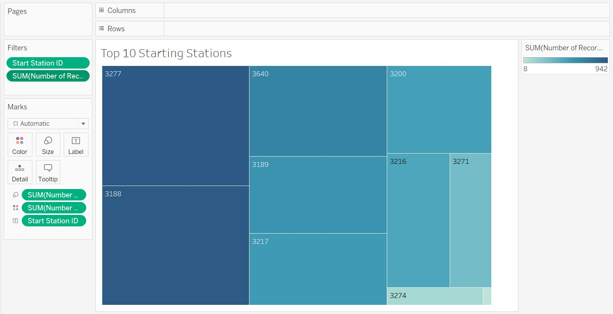

* As stated above, the most popular stations for ending a journey are in the surrounding boroughs as most people who work in Manhattan live outside it.

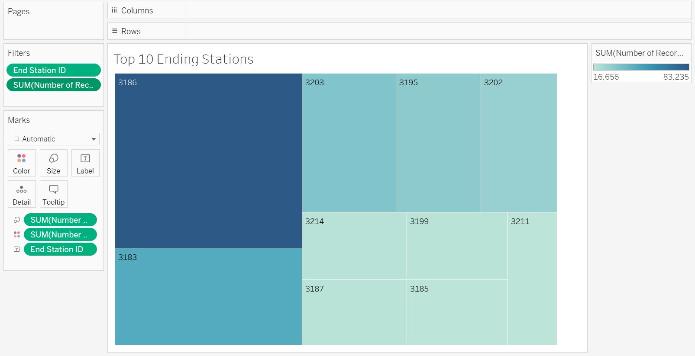

* The least popular starting stations are all in Manhattan as well, which makes sense since most starting stations are there.

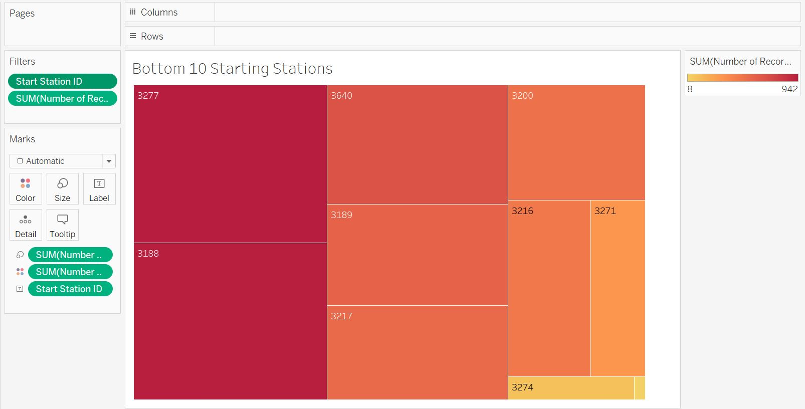

* The least popular ending stations are most outside Manhattan, which again makes sense since the biggest number of ending stations are outside Manhattan.

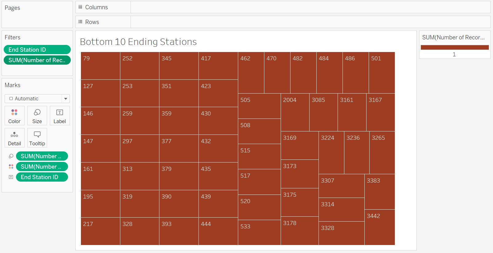

* The majority by a wide margin of participants are male, making up almost three quarters of all participants. The male portion increased YoY by almost one point, as did female participation from 20.39% to 20.92% YoY. However, this may not indicate that more males and females are actually using CitiBike, as it could simply mean more people are now identifying as either one, since the number of “unknown” gender decreased by almost a point and a half YoY.

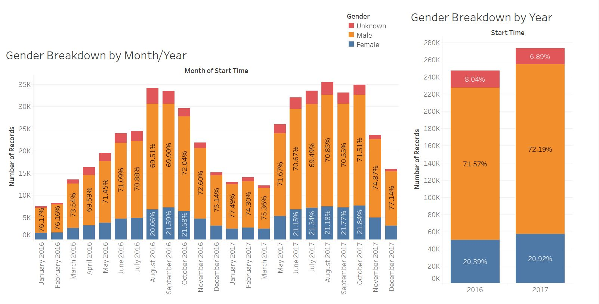

* Female ridership has increased consistently each month compared to last year’s month, except for September where ridership fell by just less than a point. 

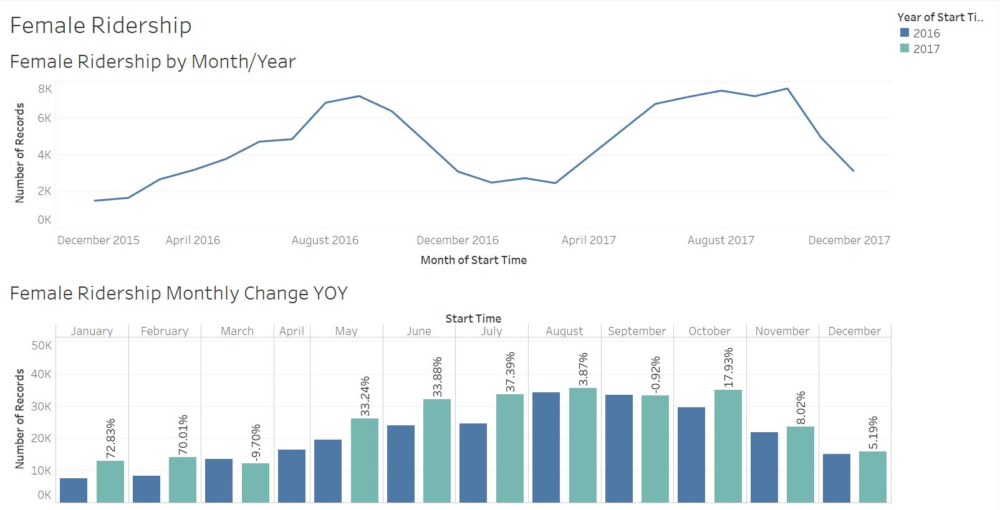

* The trip duration is generally higher in the late teens/early 20s age range, with the longest duration achieved by 21-year-olds. The other ages are about the same trip duration, except for 44-year-olds, who have the second highest trip duration, and 73- to 74-year-olds, surprisingly.

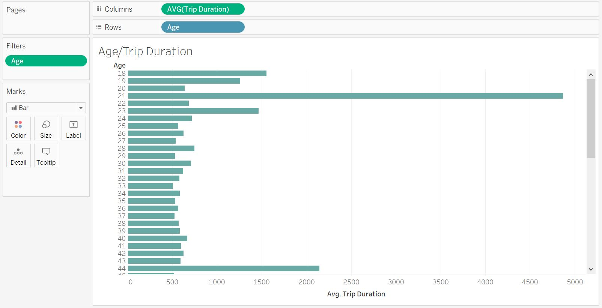

**Additionally, city officials would like to see the following visualizations:**

* A static map that plots all bike stations with a visual indication of the most popular locations to start and end a journey with zip code data overlaid on top.

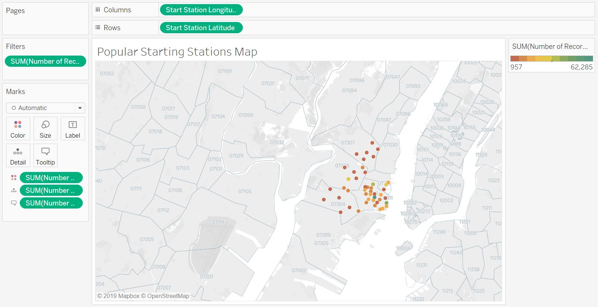

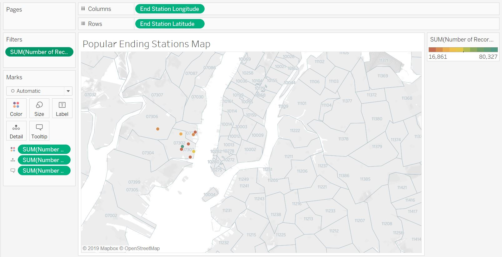

